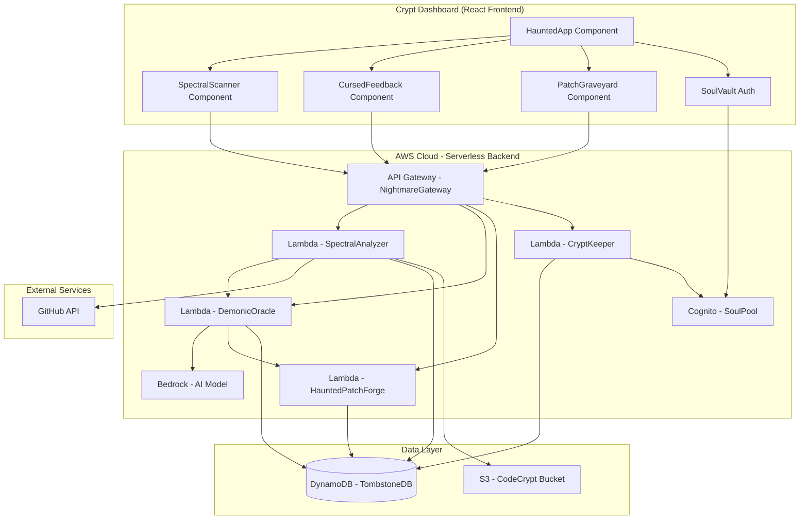

# Design Document

## Overview

The Cursed Code Reviewer is a full-stack application consisting of a React frontend (Crypt Dashboard) and a backend API service. The system integrates with AI language models to analyze code and generate demonic feedback with automatic fix suggestions. The architecture follows a client-server model with RESTful API communication, featuring Halloween-themed naming conventions throughout.

## Architecture



### Technology Stack

**Frontend:**
- React 18+ with TypeScript
- Vite for build tooling
- TailwindCSS for Halloween-themed styling
- React Query for API state management
- Monaco Editor for code display with syntax highlighting
- AWS Amplify for authentication integration

**Backend (AWS Serverless):**
- AWS Lambda with Node.js 20.x runtime
- TypeScript
- AWS Bedrock (Claude or Titan models) for AI analysis
- AWS API Gateway for REST API
- AWS Cognito for Soul Token authentication
- DynamoDB for TombstoneDB
- S3 for storing large code submissions
- AWS SDK v3

## Components and Interfaces

### Frontend Components

#### HauntedApp
Main application shell that manages routing and global state.

```typescript
interface HauntedAppProps {
  soulToken?: string;
}

interface HauntedAppState {
  isAuthenticated: boolean;
  currentSpectralScan?: SpectralScanResult;
  hauntedTheme: ThemeConfig;
}
```

#### SpectralScanner
Component for submitting code files or PR URLs for review.

```typescript
interface SpectralScannerProps {
  onScanComplete: (result: SpectralScanResult) => void;
}

interface ScanSubmission {
  type: 'file' | 'pr' | 'text';
  content: string;
  language?: string;
  severityLevel: 'minor' | 'moderate' | 'critical';
  autoFixEnabled: boolean;
}
```

#### CursedFeedback
Displays demonic feedback for identified code issues.

```typescript
interface CursedFeedbackProps {
  issues: CursedIssue[];
  demonicPersonality: 'sarcastic' | 'angry' | 'disappointed';
}

interface CursedIssue {
  id: string;
  severity: 'minor' | 'moderate' | 'critical';
  lineNumber: number;
  columnNumber: number;
  demonicMessage: string;
  technicalExplanation: string;
  hauntedPatch?: HauntedPatch;
}
```

#### PatchGraveyard
Displays and manages suggested code fixes.

```typescript
interface PatchGraveyardProps {
  patches: HauntedPatch[];
  onAcceptPatch: (patchId: string) => void;
  onRejectPatch: (patchId: string) => void;
}

interface HauntedPatch {
  id: string;
  issueId: string;
  originalCode: string;
  cursedCode: string;
  explanation: string;
  confidence: number;
}
```

#### SoulVault
Authentication component for managing Soul Tokens.

```typescript
interface SoulVaultProps {
  onAuthenticated: (token: string) => void;
}

interface SoulCredentials {
  email: string;
  password: string;
}
```

### Backend Services (AWS Lambda Functions)

#### NightmareGateway (API Gateway)
REST API with Lambda integrations.

**Endpoints:**
- `POST /api/v1/spectral-scan` - Submit code for review (→ SpectralAnalyzer Lambda)
- `GET /api/v1/spectral-scan/{scanId}` - Retrieve scan results (→ SpectralAnalyzer Lambda)
- `POST /api/v1/haunted-patch/accept` - Accept a suggested patch (→ HauntedPatchForge Lambda)
- `GET /api/v1/crypt-history` - Retrieve review history (→ SpectralAnalyzer Lambda)

**Authorization:**
- AWS Cognito User Pool (SoulPool) authorizer
- JWT token validation on all protected endpoints

#### SpectralAnalyzer Lambda
Analyzes code and orchestrates the review process.

```typescript
interface SpectralAnalyzerHandler {
  scanCode(event: APIGatewayEvent): Promise<APIGatewayResponse>;
  fetchPullRequest(prUrl: string): Promise<PRDiff>;
  detectLanguage(code: string): string;
  storeCodeInS3(code: string, scanId: string): Promise<string>;
  retrieveCodeFromS3(s3Key: string): Promise<string>;
}

interface SpectralScanResult {
  scanId: string;
  timestamp: Date;
  issues: CursedIssue[];
  overallCurseLevel: number;
  scanDuration: number;
}

// Environment Variables
// - TOMBSTONE_TABLE_NAME: DynamoDB table name
// - CODE_CRYPT_BUCKET: S3 bucket for code storage
// - DEMONIC_ORACLE_FUNCTION: DemonicOracle Lambda ARN
```

#### DemonicOracle Lambda
AI service using AWS Bedrock for generating cursed feedback.

```typescript
interface DemonicOracleHandler {
  conjureDemonicFeedback(event: LambdaEvent): Promise<string>;
  summonHauntedPatch(issue: CodeIssue, context: CodeContext): Promise<HauntedPatch>;
  selectCursedPersonality(severity: string): PersonalityConfig;
  invokeBedrockModel(prompt: string): Promise<BedrockResponse>;
}

interface PersonalityConfig {
  tone: string;
  phraseBank: string[];
  intensityLevel: number;
}

interface BedrockRequest {
  modelId: string; // e.g., "anthropic.claude-3-sonnet-20240229-v1:0"
  prompt: string;
  maxTokens: number;
  temperature: number;
}

// Environment Variables
// - BEDROCK_MODEL_ID: Bedrock model identifier
// - BEDROCK_REGION: AWS region for Bedrock
```

#### HauntedPatchForge Lambda
Generates and validates code fixes.

```typescript
interface HauntedPatchForgeHandler {
  forgePatch(event: LambdaEvent): Promise<HauntedPatch>;
  applyPatch(originalCode: string, patch: HauntedPatch): string;
  validatePatch(patch: HauntedPatch): boolean;
  storePatchInDynamoDB(patch: HauntedPatch): Promise<void>;
}

// Environment Variables
// - TOMBSTONE_TABLE_NAME: DynamoDB table name
```

#### CryptKeeper Lambda
Handles custom authentication logic and token management.

```typescript
interface CryptKeeperHandler {
  validateSoulToken(event: APIGatewayAuthorizerEvent): Promise<AuthorizerResponse>;
  enrichUserContext(userId: string): Promise<UserContext>;
}

// Note: Primary authentication handled by Cognito SoulPool
// This Lambda provides additional authorization logic if needed
```

## Data Models

### DynamoDB TombstoneDB Schema

DynamoDB uses a single-table design with the following access patterns:

**Primary Key Structure:**
- PK (Partition Key): Entity identifier
- SK (Sort Key): Entity type or relationship identifier

**Global Secondary Indexes:**
- GSI1: soulId-scanTimestamp-index (for user scan history)
- GSI2: scanId-issueId-index (for issue lookups)

```typescript
// User (Soul) Model - Stored in Cognito, minimal data in DynamoDB
interface SoulRecord {
  PK: string;              // "SOUL#${soulId}"
  SK: string;              // "METADATA"
  entityType: 'Soul';
  soulId: string;
  email: string;
  createdAt: string;       // ISO 8601
  lastSeenAt: string;
  preferences: {
    defaultSeverity: string;
    autoFixEnabled: boolean;
  };
}

// Spectral Scan Model
interface SpectralScanRecord {
  PK: string;              // "SCAN#${scanId}"
  SK: string;              // "METADATA"
  entityType: 'SpectralScan';
  scanId: string;
  soulId: string;          // GSI1 PK
  submissionType: 'file' | 'pr' | 'text';
  s3CodeKey?: string;      // Reference to S3 for large code
  language: string;
  severityLevel: string;
  scanTimestamp: string;   // ISO 8601, GSI1 SK
  scanDuration: number;
  overallCurseLevel: number;
  ttl?: number;            // Unix timestamp for auto-deletion after 90 days
}

// Cursed Issue Model
interface CursedIssueRecord {
  PK: string;              // "SCAN#${scanId}"
  SK: string;              // "ISSUE#${issueId}"
  entityType: 'CursedIssue';
  issueId: string;         // GSI2 PK
  scanId: string;          // GSI2 SK
  severity: string;
  lineNumber: number;
  columnNumber: number;
  demonicMessage: string;
  technicalExplanation: string;
  ruleId: string;
}

// Haunted Patch Model
interface HauntedPatchRecord {
  PK: string;              // "SCAN#${scanId}"
  SK: string;              // "PATCH#${patchId}"
  entityType: 'HauntedPatch';
  patchId: string;
  issueId: string;
  originalCode: string;
  cursedCode: string;
  explanation: string;
  confidence: number;
  accepted: boolean;
  appliedAt?: string;      // ISO 8601
}
```

### S3 CodeCrypt Bucket Structure

```
code-crypt-bucket/
├── scans/
│   └── ${scanId}/
│       ├── original.txt
│       └── metadata.json
└── patches/
    └── ${patchId}/
        └── fixed.txt
```

### AWS Cognito SoulPool

User authentication managed by Cognito User Pool with:
- Email/password authentication
- JWT token generation
- Custom attributes: `custom:curseLevel`, `custom:totalScans`
- Password policy: Minimum 8 characters, requires special characters

## Error Handling

### Frontend Error Handling

1. **Network Errors**: Display cursed error messages in demonic voice when API calls fail
2. **Validation Errors**: Show haunted warnings for invalid input before submission
3. **Authentication Errors**: Redirect to SoulVault with appropriate demonic message
4. **Timeout Errors**: Display spectral loading states with timeout warnings after 30 seconds

### Backend Error Handling

1. **Bedrock Service Failures**: Fallback to rule-based analysis if Bedrock is unavailable or throttled
2. **Lambda Timeout**: Set timeout to 30 seconds with early warning at 25 seconds
3. **DynamoDB Throttling**: Implement exponential backoff retry logic
4. **S3 Upload Failures**: Return error and suggest reducing code size
5. **Rate Limiting**: API Gateway throttling with 429 status and cursed "too many souls" message
6. **Invalid Code**: Return structured error with specific parsing failure details
7. **Authentication Failures**: Cognito returns 401 with token expiration or invalid credentials message
8. **Lambda Cold Starts**: Provision concurrency for critical functions to reduce latency

### Error Response Format

```typescript
interface CursedErrorResponse {
  error: {
    code: string;
    demonicMessage: string;
    technicalDetails: string;
    timestamp: Date;
  };
}
```

## Testing Strategy

### Frontend Testing

1. **Component Tests**: Jest and React Testing Library for all major components
   - SpectralScanner submission flows
   - CursedFeedback rendering with various issue types
   - PatchGraveyard accept/reject interactions
   - SoulVault authentication flows

2. **Integration Tests**: Test API integration with mock backend
   - Complete scan submission and result display flow
   - Authentication and token management
   - Patch acceptance and code updates

3. **Visual Tests**: Ensure Halloween theme consistency
   - Color scheme validation
   - Responsive design across screen sizes
   - Dark mode compatibility

### Backend Testing

1. **Lambda Unit Tests**: Test individual Lambda functions in isolation
   - SpectralAnalyzer code parsing and issue detection
   - DemonicOracle Bedrock prompt generation and response parsing
   - HauntedPatchForge patch generation and application
   - Mock AWS SDK calls (DynamoDB, S3, Bedrock)

2. **Integration Tests**: Test Lambda functions with LocalStack or AWS SAM Local
   - Complete spectral scan workflow
   - Cognito authentication flows
   - DynamoDB operations and data persistence
   - S3 upload/download operations

3. **Bedrock Service Tests**: Mock Bedrock responses for consistent testing
   - Validate prompt formatting for Claude/Titan models
   - Test response parsing and error handling
   - Verify fallback mechanisms when Bedrock is unavailable
   - Test throttling and retry logic

### Performance Testing

1. **Load Testing**: Verify system handles multiple concurrent scans
2. **Response Time**: Ensure scans complete within 30-second target
3. **Memory Usage**: Monitor for memory leaks during long sessions

## Halloween Theme Design System

### Color Palette

```css
--cursed-black: #0a0a0a
--graveyard-gray: #1a1a1a
--phantom-purple: #6b21a8
--blood-red: #dc2626
--toxic-green: #10b981
--ghostly-white: #f3f4f6
--shadow-purple: #4c1d95
--haunted-orange: #ea580c
```

### Typography

- Headers: "Creepster" or "Nosifer" Google Fonts
- Body: "Roboto Mono" for code, "Inter" for text
- Cursed feedback: Slightly larger, bold, with color emphasis

### UI Elements

- Buttons: Rounded with glow effects on hover
- Cards: Dark backgrounds with subtle purple borders
- Inputs: Dark with ghostly-white text and haunted-orange focus rings
- Code blocks: Monaco editor with custom Halloween theme
- Icons: Halloween-themed (skulls, ghosts, bats, pumpkins)

### Animations

- Fade-in effects for feedback messages
- Pulse animations for critical issues
- Hover glow effects on interactive elements
- Smooth transitions between views
